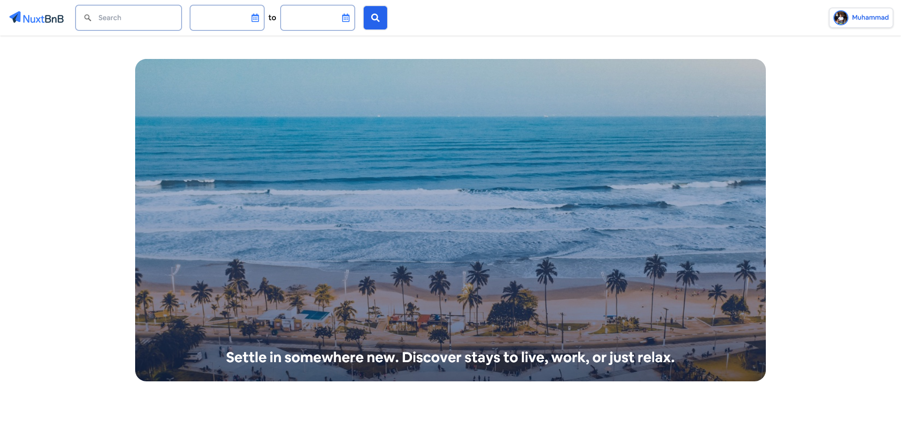

# NuxtBnB

An Airbnb-like website. Built with Nuxt.js and using Algolia, Mapbox, Stripe, Firebase Auth and more.

### 🔗 Links

- [Live Site](https://nuxtbnb-m98.herokuapp.com/)
- [Source Repo](https://github.com/MuhammadM1998/NuxtBnB)

### ‍💻 Stack

Feedback is always appreciated 📝🙏
